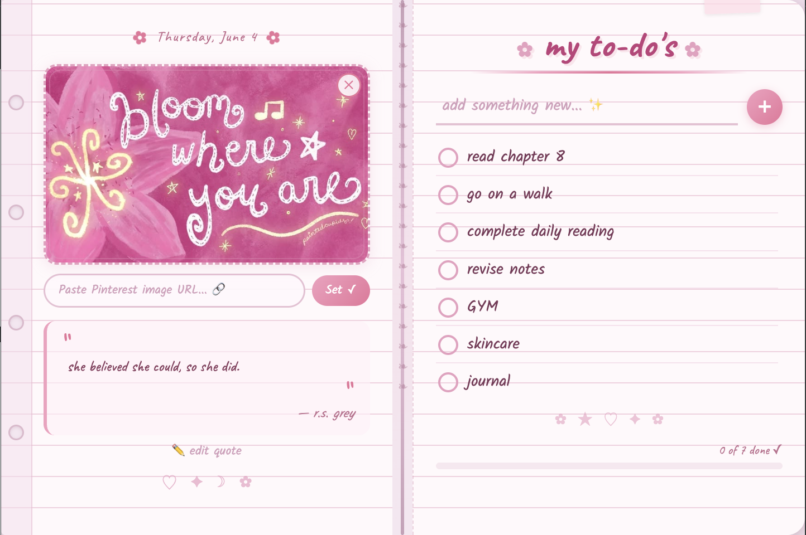
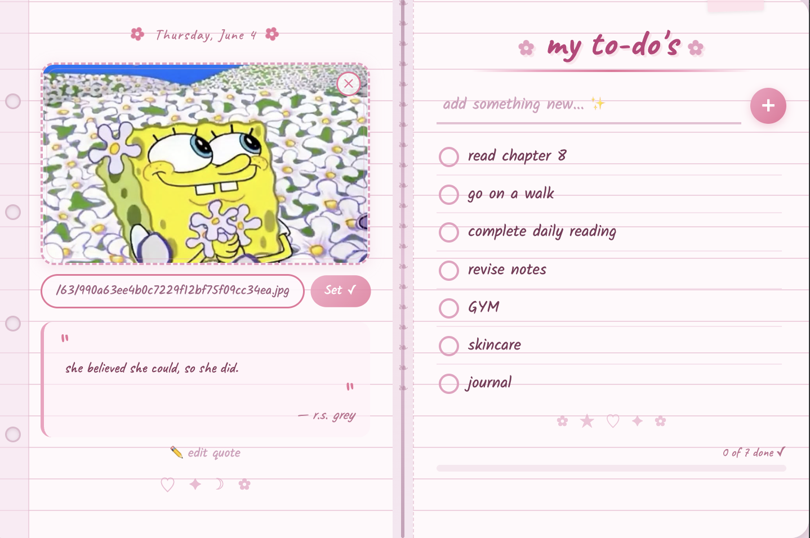

<div align="center">


# 🌸 Pink Planner

### A cute notebook-inspired Chrome extension for organizing your life in style ✨

Pink Planner helps you stay productive with aesthetic task management, motivational quotes, progress tracking, and customizable Pinterest-style visuals — all inside a cozy digital planner.


</div>

---

## ✨ Features

- 🌷 Add, complete, and delete tasks
- 💖 Daily motivational quotes
- ✏️ Customize your own quotes
- 🖼️ Add aesthetic Pinterest-style images
- 📊 Automatic task progress tracking
- 💾 Saves data locally using Chrome Storage
- 📖 Cute notebook-inspired UI
- 🌸 Soft pink aesthetic workspace

---

# 📸 Screenshots

## 🌸 Main Planner View



---

## 🖼️ Custom Quotes & Pinterest Images

<!-- Replace with your screenshot -->


---

# 🚀 Installation

## Load as an Unpacked Chrome Extension

### 1. Clone this repository

```bash
git clone https://github.com/oliviagunda/pink-planner.git
```

### 2. Open Chrome Extensions

Go to:

```text
chrome://extensions
```

### 3. Enable Developer Mode

Turn on **Developer Mode** using the toggle in the top-right corner.

### 4. Click "Load unpacked"

Select the project folder.

### 5. Pin the extension

Pin Pink Planner to your Chrome toolbar and start planning ✨

---

# 💡 How to Use

## 🌷 Add Tasks

- Type your task into the input field
- Press **Enter** or click the **+** button
- Click the checkbox to mark tasks complete

---

## ✏️ Customize Quotes

- Click **Edit Quote**
- Enter your own motivational quote
- Save your changes

---

## 🖼️ Add Pinterest Images

Pink Planner allows you to display aesthetic Pinterest-style images inside the planner.

### Important:

Pinterest page links will **NOT** work directly.

You must:

1. Open the Pinterest image in a **new tab**
2. Copy the direct image URL that starts with:

```text
https://i.pinimg.com/
```

3. Paste the link into the planner image input
4. Click **Set**

✅ Example of a valid image link:

```text
https://i.pinimg.com/736x/ab/cd/ef/example.jpg
```

---

## 📊 Progress Tracking

The progress bar updates automatically based on completed tasks.

Stay motivated as you complete your daily goals 🌸

---

# 🛠️ Built With

- HTML
- CSS
- JavaScript
- Chrome Extension APIs
- Chrome Storage API

---

# 📂 Project Structure

```text
pink-planner/
│
├── manifest.json
├── popup.html
├── popup.js
├── styles.css
│
├── images/
│   └── logo.png
│
├── screenshots/
│   ├── main-view.png
│   ├── tasks.png
│   └── customization.png
│
└── README.md
```

---

# 🌟 Future Improvements

- 📅 Calendar integration
- 🔔 Reminders & notifications
- 🎨 Multiple planner themes
- ☁️ Cloud sync
- 📝 Task categories
- 🔥 Daily productivity streaks
- 📌 Drag-and-drop task organization

---

# 📄 License

This project is licensed under the MIT License.

---

<div align="center">

Made with 💖, pink aesthetics, and productivity energy ✨

</div>